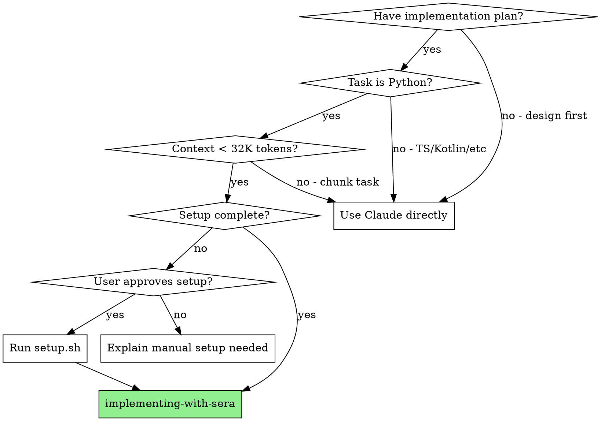

# Implementing with SERA

Delegate implementation tasks to local SERA-32B model via Goose, reserving Claude for design and complex reasoning.

**Announce at start:** "I'm using the implementing-with-sera skill to delegate this task to SERA."

## When to Use



**Use this skill when ALL conditions are met:**
- Design document exists and is approved (`*-design.md`)
- Implementation plan exists (`*-implementation.md`)
- Task is primarily Python code
- Task is well-defined with clear acceptance criteria
- Context fits within 32K tokens

**Do NOT use when:**
- Design phase (use Claude for architecture decisions)
- Non-Python code (TypeScript, Kotlin, etc.)
- Complex multi-file refactoring
- Tasks requiring deep codebase understanding
- Security-sensitive implementations

## Setup Check (REQUIRED FIRST STEP)

**Before ANY task delegation, check setup status:**

```bash
# Check 1: Does Goose exist?
command -v goose

# Check 2: Is SERA venv created (Python 3.12)?
test -d ~/.sera-venv

# Check 3: Is SERA provider configured?
test -f ~/.config/goose/custom_providers/sera_mlx.json

# Check 4: Can server script run?
./scripts/sera-server.sh status
```

**Decision based on results:**

| Check Result | Action |
|--------------|--------|
| All pass, server running | ✅ Proceed to task delegation |
| All pass, server stopped | Run `./scripts/sera-server.sh start`, then proceed |
| Any check fails | Setup incomplete → **STOP AND ASK USER** (see below) |

**Note:** The setup creates:
- Virtual environment at `~/.sera-venv` with Python 3.12
- Goose provider at `~/.config/goose/custom_providers/sera_mlx.json`
- Default config at `~/.config/goose/config.yaml`

### If Setup Incomplete: MANDATORY USER PROMPT

```
┌─────────────────────────────────────────────────────────────────┐
│  YOU MUST ASK THE USER. DO NOT DECIDE FOR THEM.                │
│  DO NOT PROCEED UNTIL USER RESPONDS.                           │
└─────────────────────────────────────────────────────────────────┘
```

**Say EXACTLY this (copy verbatim):**

> SERA setup is not complete. This requires:
> - Installing uv and creating Python 3.12 venv
> - Installing mlx-lm and mlx-openai-server
> - Downloading the SERA-32B model (18.4GB)
> - Installing Goose and configuring provider + profile
>
> **Option 1:** I can run the setup script now (will take several minutes for model download)
> **Option 2:** I can implement this task directly using Claude instead
>
> Which would you prefer?

**Then STOP and WAIT for user response.**

- If user says "setup" / "option 1" / "run it" → Run `./scripts/setup.sh`
- If user says "implement" / "option 2" / "directly" / "Claude" → Implement directly
- If user says something else → Ask for clarification

**NEVER assume the user's choice. NEVER proceed without explicit response.**

## Process

### Step 1: Verify Setup (see above)

Complete the setup check before proceeding.

### Step 2: Start Server If Needed

```bash
./scripts/sera-server.sh status || ./scripts/sera-server.sh start
```

Wait for: "✅ SERA server started successfully"

### Step 3: Extract Task from Plan

From the implementation plan, extract:
- Task specification (exact text)
- Acceptance criteria
- Files to create/modify
- Test file paths

### Step 4: Create Task Context

Create `/tmp/sera-task-context.md`:

```markdown
# Task: [Task Name from Plan]

## Design Reference
See: docs/plans/YYYY-MM-DD-feature-design.md
Section: [Relevant section]

## Task Specification
[Exact task text from implementation plan]

## Acceptance Criteria
1. [Criterion 1]
2. [Criterion 2]
3. All tests pass
4. No lint errors

## Files
- Create: path/to/new_file.py
- Test: tests/test_file.py

## Constraints
- Follow existing patterns in [directory]
- Use [framework] for [purpose]
```

### Step 5: Execute

```bash
./scripts/sera-run.sh /tmp/sera-task-context.md
```

This automatically:
1. Injects TDD instructions via goosehints
2. Runs Goose with sera_mlx provider
3. Runs pytest after completion
4. Runs ruff check after completion
5. Commits on success

### Step 6: Handle Result

**If successful:** Report completion, move to next task

**If tests fail after SERA completes:**
- Check `sera-run.sh` output for specific failures
- If minor: Re-run with fix instructions
- If major (2+ iterations failed): Fall back to Claude

## Fallback Criteria

**Fall back to Claude if:**
- SERA produces incorrect code after 2 iterations
- Task requires understanding beyond provided context
- Complex architectural decisions needed
- SERA runs out of context window
- Tests fail repeatedly with same error

### If SERA Fails at Runtime: MANDATORY USER PROMPT

When SERA execution fails (Goose error, crash, timeout, etc.):

```
┌─────────────────────────────────────────────────────────────────┐
│  SERA FAILED. DO NOT SILENTLY SWITCH TO CLAUDE.                 │
│  ASK THE USER WHAT THEY WANT TO DO.                            │
└─────────────────────────────────────────────────────────────────┘
```

**Say EXACTLY this:**

> SERA execution failed with error: [paste actual error]
>
> **Option 1:** Debug and retry SERA (check server, config, logs)
> **Option 2:** I can implement this task directly using Claude instead
>
> Which would you prefer?

**Then STOP and WAIT for user response.**

- If user says "debug" / "retry" / "option 1" → Check logs, restart server, retry
- If user says "implement" / "option 2" / "Claude" → Implement directly
- If user says something else → Ask for clarification

**NEVER silently switch to Claude when SERA fails.**

## Red Flags - STOP

| Thought | Reality |
|---------|---------|
| "Skip setup check, probably fine" | Setup check is REQUIRED. Run it. |
| "SERA can handle non-Python" | SERA only validated on Python. Use Claude. |
| "Just one more SERA attempt" | 2 failures = fall back. Don't thrash. |
| "I'll run tests manually after" | sera-run.sh runs tests. Let it. |
| "Skip the context file" | Context file is how SERA gets instructions. Required. |
| **"Since SERA isn't available, I'll just..."** | **NO. ASK THE USER. Do not decide for them.** |
| **"User probably wants me to..."** | **NO. ASK. Never assume user preference.** |
| **"SERA failed, let me implement directly"** | **NO. ASK THE USER. Show error, present options, wait.** |
| **"Let me implement the tasks directly using Claude instead"** | **NO. This is the exact rationalization to avoid. ASK FIRST.** |

## Integration

**Required workflow skills:**
- **superpowers:writing-plans** - Creates the plan this skill executes
- **superpowers:finishing-a-development-branch** - Complete after all tasks done

**Related:**
- **superpowers:executing-plans** - Alternative for non-SERA execution
- **superpowers:test-driven-development** - SERA follows TDD via goosehints

## Limitations

See `references/limitations.md` for full details:
- Python only
- 32K context window
- Teacher-bounded by GLM-4.6
- No built-in safety filtering - review output
