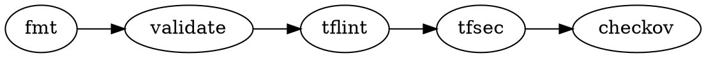

# Terraform Linting

## Overview

Lint and security scan Terraform using tflint, tfsec, and checkov.

**Announce at start:** "I'm using the lint-terraform skill to validate infrastructure code."

## When to Use

- Terraform directory detected during `/devtools:quality-check`
- Before `terraform apply`
- Fixing linter findings

## Execution Order

## Quick Reference

| Tool | Purpose | Install |
|------|---------|---------|
| `terraform fmt` | Format | Built-in |
| `tflint` | Lint | `brew install tflint` |
| `tfsec` | Security | `brew install tfsec` |
| `checkov` | Policy | `pip install checkov` |

## References

- @references/tflint-config.md - Configuration setup
- @references/common-fixes.md - Hardcoded creds, permissive SGs, missing encryption
- @references/github-actions.md - CI workflow

## Completion Criteria

- [ ] `terraform fmt -check` passes
- [ ] `terraform validate` passes
- [ ] `tflint` no errors
- [ ] `tfsec` no HIGH/CRITICAL
- [ ] `checkov` passes
