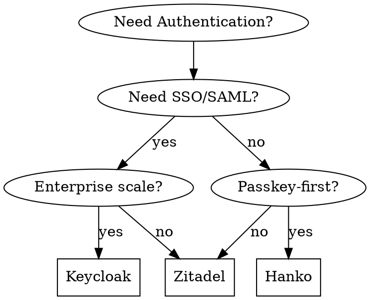

# Passkey Authentication Options

## Comparison Matrix

| Feature | Hanko | Keycloak | Zitadel | Custom |
|---------|-------|----------|---------|--------|
| **Passkey Support** | Native | Plugin | Native | Manual |
| **Setup Time** | 30 min | 2-4 hrs | 1-2 hrs | Days |
| **Self-hosted** | Yes | Yes | Yes | Yes |
| **Cloud Option** | Yes | Red Hat SSO | Yes | No |
| **SSO/SAML** | Limited | Full | Full | Manual |
| **OAuth2/OIDC** | Yes | Yes | Yes | Manual |
| **User Management UI** | Yes | Yes | Yes | Build |
| **Maintenance** | Low | High | Medium | High |
| **Community** | Growing | Large | Growing | N/A |

## Hanko

**Best for:** MVP, startups, passkey-first applications

**Pros:**
- Passkey-first design
- Simple, modern architecture
- Minimal configuration
- Built-in user management
- Good documentation

**Cons:**
- Limited SSO/SAML (enterprise features)
- Newer project, smaller community
- Fewer integrations

**When to choose:**
- Building new application
- Passkeys are primary auth method
- Don't need enterprise SSO
- Want minimal setup time

## Keycloak

**Best for:** Enterprise, complex auth requirements

**Pros:**
- Mature, battle-tested
- Full SAML/OIDC support
- Identity brokering
- Fine-grained permissions
- Large ecosystem

**Cons:**
- Complex configuration
- Passkeys via plugin (webauthn4j)
- Resource intensive
- Steep learning curve

**When to choose:**
- Enterprise environment
- Need SAML federation
- Complex authorization rules
- Existing Keycloak infrastructure

## Zitadel

**Best for:** Modern cloud-native deployments

**Pros:**
- Modern architecture
- Good passkey support
- Actions (custom logic)
- Multi-tenant native
- Good developer experience

**Cons:**
- Less mature than Keycloak
- Fewer integrations
- Smaller community

**When to choose:**
- Cloud-native stack
- Multi-tenant SaaS
- Modern architecture preferred
- Need both passkeys and SSO

## Custom Implementation

**Best for:** Learning, specific requirements

**Pros:**
- Full control
- No vendor lock-in
- Learn WebAuthn deeply
- Optimize for your needs

**Cons:**
- Security responsibility
- Maintenance burden
- Longer development time
- Easy to make mistakes

**When to choose:**
- Educational purposes
- Very specific requirements
- Already have auth expertise
- Research/prototyping

## Decision Flowchart

## Recommendation for Health Data Platform

**Start with Hanko** because:
1. Passkeys are ideal for health data (phishing-resistant)
2. Quick to set up for MVP
3. Can migrate to Keycloak later if needed
4. Lower maintenance burden
