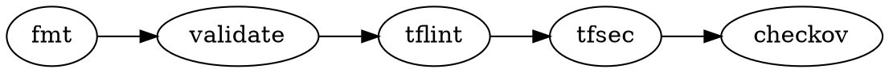

# Health Data Platform: New Skills Specification

**Date:** 2025-01-27  
**Purpose:** Define new Claude skills/commands to support health data platform development  
**Target Project:** ~/health-data-ai-platform  
**Roadmap Reference:** health-data-skill-development-roadmap.md  
**Pattern Reference:** Follow `superpowers:writing-skills` patterns

---

## Superpowers Pattern Compliance

Each skill MUST follow these patterns from `superpowers:writing-skills`:

| Pattern | Requirement |
|---------|-------------|
| **Frontmatter** | Only `name` and `description` (no `version`) |
| **Description** | "Use when..." triggering conditions ONLY, NOT workflow summary |
| **Word count** | SKILL.md <200 words, reference files for heavy content |
| **Announcement** | "I'm using the X skill to..." at start |
| **Good/Bad tags** | `<Good>` and `<Bad>` for examples |
| **Cross-refs** | `devtools:skill-name` with REQUIRED markers |
| **Flowcharts** | Only for non-obvious decisions (dot format) |
| **Completion checklist** | Required at end |

---

## Skills to Create

| Skill | Category | Priority | Roadmap Phase |
|-------|----------|----------|---------------|
| `lint-terraform` | quality-gates | 🔴 High | Phase 0, 5 |
| `local-kubernetes` | workflows | 🔴 High | Phase 0 |
| `airflow-dag` | workflows | 🟡 Medium | Phase 1 |
| `mlflow-tracking` | workflows | 🟡 Medium | Phase 1, 3 |
| `kafka-streaming` | workflows | 🟡 Medium | Phase 2 |
| `passkey-auth` | workflows | 🟢 Low | Future |

---

## Skill 1: lint-terraform

### Location

```
skills/quality-gates/lint-terraform/
├── SKILL.md              # <200 words
├── tflint-config.md      # .tflint.hcl setup
├── tfsec-rules.md        # .tfsec.yml customization
├── github-actions.md     # CI workflow (commit-pinned)
└── common-fixes.md       # Issue remediation with <Good>/<Bad>
```

### SKILL.md

```markdown
---
name: lint-terraform
description: Use when running quality checks on Terraform, before terraform apply, or when tflint/tfsec/checkov report issues
---

# Terraform Linting

## Overview

Lint and security scan Terraform using tflint, tfsec, and checkov.

**Announce at start:** "I'm using the lint-terraform skill to validate infrastructure code."

## When to Use

- Terraform directory detected during `/devtools:quality-check`
- Before `terraform apply`
- Fixing linter findings

## Execution Order



## Quick Reference

| Tool | Purpose | Install |
|------|---------|---------|
| `terraform fmt` | Format | Built-in |
| `tflint` | Lint | `brew install tflint` |
| `tfsec` | Security | `brew install tfsec` |
| `checkov` | Policy | `pip install checkov` |

## References

- @tflint-config.md - Configuration setup
- @common-fixes.md - Hardcoded creds, permissive SGs, missing encryption
- @github-actions.md - CI workflow

## Completion Criteria

- [ ] `terraform fmt -check` passes
- [ ] `terraform validate` passes
- [ ] `tflint` no errors
- [ ] `tfsec` no HIGH/CRITICAL
- [ ] `checkov` passes
```

### Reference: common-fixes.md

```markdown
# Common Terraform Fixes

## Hardcoded Credentials

<Bad>
provider "aws" { access_key = "AKIA..." }
</Bad>

<Good>
provider "aws" { } # Uses env vars or IAM role
</Good>

## Permissive Security Groups

<Bad>
cidr_blocks = ["0.0.0.0/0"]
</Bad>

<Good>
cidr_blocks = [var.allowed_cidr]
</Good>

## Missing Encryption

<Bad>
resource "aws_s3_bucket" "x" { bucket = "my-bucket" }
</Bad>

<Good>
resource "aws_s3_bucket_server_side_encryption_configuration" "x" {
  bucket = aws_s3_bucket.x.id
  rule { apply_server_side_encryption_by_default { sse_algorithm = "AES256" } }
}
</Good>
```

---

## Skill 2: local-kubernetes

### Location

```
skills/workflows/local-kubernetes/
├── SKILL.md              # <200 words
├── k3d-setup.md          # k3d cluster creation
├── terraform-k3d.md      # Terraform k3d provider
├── helm-deployments.md   # PostgreSQL, Redis via Helm
└── local-registry.md     # Building/pushing images
```

### SKILL.md

```markdown
---
name: local-kubernetes
description: Use when setting up local Kubernetes cluster, testing Helm charts, or before cloud deployment
---

# Local Kubernetes

## Overview

Set up k3s clusters via k3d for local development, managed with Terraform.

**Announce at start:** "I'm using the local-kubernetes skill to set up the development cluster."

**REQUIRED SUB-SKILL:** Use devtools:lint-terraform for Terraform validation.

## When to Use

- Local development before cloud
- Testing Helm charts
- CI/CD testing of K8s manifests

## Why k3s/k3d

| k3s | Kind |
|-----|------|
| Production-like | CI testing only |
| Edge/IoT career relevance | Limited |
| Real networking | Docker abstraction |
| Built-in ServiceLB | Needs MetalLB |

## Quick Start

```bash
k3d cluster create health-platform \
  --servers 1 --agents 2 \
  --registry-create health-registry:5000 \
  --port "8080:80@loadbalancer"
```

## References

- @k3d-setup.md - Manual setup
- @terraform-k3d.md - IaC approach (recommended)
- @helm-deployments.md - PostgreSQL, Redis
- @local-registry.md - Image workflow

## Completion Criteria

- [ ] `kubectl get nodes` shows Ready
- [ ] Local registry at localhost:5000
- [ ] PostgreSQL/Redis deployed
- [ ] Can push/pull images
```

### Reference: terraform-k3d.md

```markdown
# Terraform k3d Provider

## Provider Setup

```hcl
terraform {
  required_providers {
    k3d = {
      source  = "pvotal-tech/k3d"
      version = "~> 0.0.7"
    }
  }
}

resource "k3d_cluster" "main" {
  name    = var.cluster_name
  servers = 1
  agents  = 2

  port {
    host_port      = 8080
    container_port = 80
    node_filters   = ["loadbalancer"]
  }

  registries {
    create {
      name = "${var.cluster_name}-registry"
      port = 5000
    }
  }
}
```

## Directory Structure

```
terraform/environments/local/
├── main.tf
├── variables.tf
└── terraform.tfvars
```
```

---

## Skill 3: airflow-dag

### Location

```
skills/workflows/airflow-dag/
├── SKILL.md              # <200 words
├── taskflow-patterns.md  # TaskFlow API examples
├── docker-compose.md     # Local Airflow setup
├── testing-dags.md       # pytest patterns
└── health-connect-etl.md # Example DAG for health data
```

### SKILL.md

```markdown
---
name: airflow-dag
description: Use when creating data pipelines, ETL workflows, or scheduling batch jobs with Apache Airflow
---

# Airflow DAG Development

## Overview

Create production-ready Airflow DAGs using TaskFlow API.

**Announce at start:** "I'm using the airflow-dag skill to create the data pipeline."

**REQUIRED SUB-SKILL:** Use devtools:lint-python for code quality.

## When to Use

- ETL/ELT pipelines
- Scheduled data processing
- ML training orchestration

## TaskFlow Pattern

```python
@dag(schedule="@daily", catchup=True)
def my_pipeline():
    @task
    def extract(): ...
    
    @task
    def transform(data): ...
    
    @task  
    def load(data): ...
    
    load(transform(extract()))
```

## Testing

```bash
pytest tests/test_dags.py -v
```

## References

- @taskflow-patterns.md - @task decorator patterns
- @docker-compose.md - Local Airflow setup
- @testing-dags.md - DagBag testing
- @health-connect-etl.md - Health data example

## Completion Criteria

- [ ] DAG loads without import errors
- [ ] All tasks have proper dependencies
- [ ] Idempotent operations (upsert logic)
- [ ] Unit tests pass
- [ ] Visible in Airflow UI
```

### Reference: health-connect-etl.md

```markdown
# Health Connect ETL DAG

Example DAG for pulling Health Connect exports from Google Drive.

```python
from airflow.decorators import dag, task
from datetime import datetime

@dag(
    dag_id='health_connect_etl',
    schedule='@daily',
    start_date=datetime(2025, 9, 1),
    catchup=True,
    tags=['health-connect', 'etl']
)
def health_connect_etl():
    
    @task
    def pull_from_google_drive(execution_date: str) -> str:
        """Download Health Connect zip for date."""
        # Google Drive API integration
        ...
    
    @task
    def extract_sqlite(zip_path: str) -> str:
        """Extract SQLite from zip."""
        ...
    
    @task
    def transform_glucose(sqlite_path: str) -> list[dict]:
        """Transform Stelo glucose readings."""
        ...
    
    @task
    def load_to_postgres(data: list[dict]) -> dict:
        """Upsert to PostgreSQL."""
        ...
    
    # Flow
    zip_path = pull_from_google_drive("{{ ds }}")
    sqlite_path = extract_sqlite(zip_path)
    glucose = transform_glucose(sqlite_path)
    load_to_postgres(glucose)

health_connect_etl()
```
```

---

## Skill 4: mlflow-tracking

### Location

```
skills/workflows/mlflow-tracking/
├── SKILL.md              # <200 words
├── docker-compose.md     # MLflow + PostgreSQL + MinIO
├── experiment-logging.md # Basic tracking patterns
├── model-registry.md     # Versioning and staging
└── airflow-integration.md # MLflow in DAGs
```

### SKILL.md

```markdown
---
name: mlflow-tracking
description: Use when tracking ML experiments, versioning models, or comparing training runs
---

# MLflow Tracking

## Overview

Track ML experiments, version models, compare runs with MLflow.

**Announce at start:** "I'm using the mlflow-tracking skill to set up experiment tracking."

## When to Use

- Training ML models
- Comparing hyperparameters
- Model versioning/deployment

## Basic Usage

```python
import mlflow

mlflow.set_experiment("glucose-anomaly")

with mlflow.start_run():
    mlflow.log_params({"lr": 0.001})
    mlflow.log_metrics({"loss": 0.05})
    mlflow.pytorch.log_model(model, "model")
```

## Model Registry

```python
mlflow.register_model(f"runs:/{run_id}/model", "my-model")
client.transition_model_version_stage("my-model", 1, "Production")
```

## References

- @docker-compose.md - Local MLflow server
- @experiment-logging.md - Tracking patterns
- @model-registry.md - Staging/Production
- @airflow-integration.md - MLflow in DAGs

## Completion Criteria

- [ ] MLflow server running (localhost:5000)
- [ ] Experiments created
- [ ] Runs logged with params/metrics
- [ ] Models registered
- [ ] Can load by stage
```

---

## Skill 5: kafka-streaming

### Location

```
skills/workflows/kafka-streaming/
├── SKILL.md              # <200 words
├── docker-compose.md     # Kafka + Zookeeper + UI
├── debezium-cdc.md       # PostgreSQL CDC setup
├── python-consumer.md    # Consumer patterns
└── flink-integration.md  # Stream processing (future)
```

### SKILL.md

```markdown
---
name: kafka-streaming
description: Use when building real-time data pipelines, CDC (Change Data Capture), or event-driven systems
---

# Kafka Streaming

## Overview

Set up Kafka with CDC for real-time data streaming.

**Announce at start:** "I'm using the kafka-streaming skill to set up the streaming layer."

## When to Use

- Real-time data pipelines
- Database CDC
- Event-driven architecture

## Quick Start

```yaml
# docker-compose excerpt
services:
  kafka:
    image: confluentinc/cp-kafka:7.5.0
    ports: ["9092:9092"]
  kafka-ui:
    image: provectuslabs/kafka-ui:latest
    ports: ["8090:8080"]
```

## CDC with Debezium

Register PostgreSQL connector to capture changes:
- INSERT/UPDATE/DELETE → Kafka topics
- Real-time anomaly detection possible

## References

- @docker-compose.md - Full Kafka stack
- @debezium-cdc.md - PostgreSQL CDC
- @python-consumer.md - Consumer patterns
- @flink-integration.md - Stream processing

## Completion Criteria

- [ ] Kafka running (localhost:9092)
- [ ] Kafka UI accessible (localhost:8090)
- [ ] Debezium connector registered
- [ ] CDC events flowing
- [ ] Consumer processing events
```

---

## Skill 6: passkey-auth

### Location

```
skills/workflows/passkey-auth/
├── SKILL.md              # <200 words
├── options-comparison.md # Hanko vs Keycloak vs custom
├── hanko-setup.md        # Recommended: Hanko
├── keycloak-setup.md     # Enterprise option
└── fastapi-integration.md # Backend JWT verification
```

### SKILL.md

```markdown
---
name: passkey-auth
description: Use when adding passwordless/WebAuthn authentication, evaluating auth providers, or integrating passkeys
---

# Passkey Authentication

## Overview

Integrate passkey/WebAuthn using proven OSS solutions.

**Announce at start:** "I'm using the passkey-auth skill to evaluate authentication options."

## When to Use

- Adding passwordless auth
- Evaluating auth providers
- Modernizing authentication

## Options

| Solution | Complexity | Best For |
|----------|------------|----------|
| **Hanko** | Low | Fast integration |
| **Keycloak** | Medium | Enterprise, SSO |
| **Zitadel** | Medium | Modern, cloud-native |
| **Custom** | High | Full control |

## Recommendation

**MVP:** Use Hanko (OSS, self-hosted, passkey-first)
**Enterprise:** Keycloak if SSO/SAML needed
**Learning:** Keep mpo-api-authn-server as reference

## References

- @options-comparison.md - Detailed comparison
- @hanko-setup.md - Recommended setup
- @keycloak-setup.md - Enterprise option
- @fastapi-integration.md - Backend integration

## Completion Criteria

- [ ] Auth service running
- [ ] Can register passkey
- [ ] Can authenticate
- [ ] JWT tokens issued
- [ ] Backend verifies tokens
```

---

## Command Updates

### /devtools:quality-check Detection

Add to quality-check command logic:

```
IF terraform/ exists:
  - Run devtools:lint-terraform
  
IF dags/ exists:
  - Run pytest tests/test_*dag*.py
```

---

## Implementation Order

1. **lint-terraform** - Quality checks for existing Terraform
2. **local-kubernetes** - Simplified local infrastructure  
3. **airflow-dag** - Core pivot, enables data pipeline
4. **mlflow-tracking** - Experiment tracking from day one
5. **kafka-streaming** - Phase 2 streaming layer
6. **passkey-auth** - Future integration

---

## Testing Plan

Test each skill against health-data-ai-platform:

```bash
# 1. lint-terraform
cd ~/health-data-ai-platform
/devtools:quality-check  # Should run terraform linting

# 2. local-kubernetes  
cd ~/health-data-ai-platform/terraform/environments/local
terraform apply
kubectl get nodes

# 3. airflow-dag
docker-compose -f docker-compose.airflow.yml up
# Verify DAG in UI

# 4. mlflow-tracking
docker-compose -f docker-compose.mlflow.yml up
# Verify localhost:5000

# 5. kafka-streaming
docker-compose -f docker-compose.kafka.yml up
# Verify localhost:8090
```

---

## Verification Before Deployment

Per `superpowers:writing-skills`, each skill requires:

- [ ] **RED Phase**: Run scenarios WITHOUT skill, document baseline failures
- [ ] **GREEN Phase**: Write skill addressing specific failures
- [ ] **REFACTOR Phase**: Close loopholes found in testing
- [ ] **Quality Checks**: <200 words, proper frontmatter, completion checklist
- [ ] **Deployment**: Commit and push
