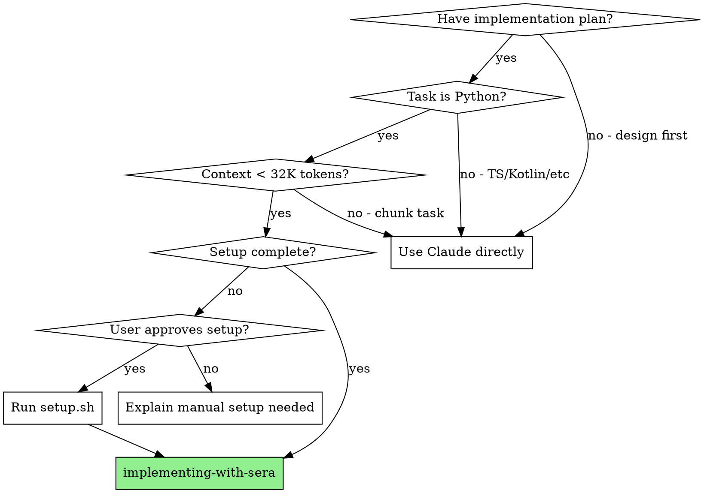

# SERA Implementation Skill - Specification

**Date:** 2026-01-30  
**Status:** Draft  
**Author:** Claude + Vinayak

## Overview

Create a skill and command for delegating implementation tasks to the local SERA-32B model via Goose, conserving Claude Pro usage for complex design and planning work.

## Goals

- Enable Claude Code to delegate implementation tasks to local SERA model
- Provide clear command for invoking SERA-based implementation
- Document setup requirements, limitations, and fallback scenarios
- Follow superpowers skill patterns for consistency

## Non-Goals

- Replace Claude for design/planning (SERA is implementation-focused)
- Support non-Python projects (SERA validated only on Python repos)
- Real-time streaming integration (batch execution via Goose)

## Architecture

```
┌─────────────────────────────────────────────────────────────────────┐
│  Claude Code (Orchestrator)                                         │
│                                                                     │
│  1. User invokes /devtools:sera command                            │
│  2. Claude prepares context document with:                         │
│     - Design document path                                          │
│     - Implementation plan path                                      │
│     - Specific task to implement                                    │
│     - Acceptance criteria                                           │
│  3. Claude invokes Goose with sera_mlx provider                    │
│                                                                     │
└────────────────────────────┬────────────────────────────────────────┘
                             │
                             ▼
┌─────────────────────────────────────────────────────────────────────┐
│  Goose Agent                                                        │
│                                                                     │
│  - Provider: sera_mlx (custom OpenAI-compatible)                   │
│  - Executes implementation task                                     │
│  - Writes code, runs tests, commits                                │
│                                                                     │
└────────────────────────────┬────────────────────────────────────────┘
                             │
                             ▼
┌─────────────────────────────────────────────────────────────────────┐
│  MLX Server                                                         │
│                                                                     │
│  - Model: hitoshura25/SERA-32B-mlx-4Bit (18.4GB)                   │
│  - Port: 8080                                                       │
│  - OpenAI-compatible API                                            │
│                                                                     │
└─────────────────────────────────────────────────────────────────────┘
```

## Project Structure

```
skills/workflows/implementing-with-sera/
├── SKILL.md                    # Main skill document
├── scripts/
│   ├── setup.sh                # One-time installation script
│   ├── sera-server.sh          # Server start/stop/status management
│   └── sera-run.sh             # Full execution wrapper
├── goosehints/
│   └── sera-implementation.md  # Goose instructions for TDD + verification
└── references/
    ├── mlx-setup.md            # Manual setup (if scripts fail)
    ├── goose-config.md         # Goose provider configuration
    └── limitations.md          # SERA model constraints

commands/
└── sera.md                     # Command for invoking SERA implementation
```

## File Specifications

### 1. SKILL.md

**Path:** `skills/workflows/implementing-with-sera/SKILL.md`

```markdown
---
name: implementing-with-sera
description: Use when delegating Python implementation tasks to local SERA model via Goose to conserve Claude usage
---

# Implementing with SERA

Delegate implementation tasks to local SERA-32B model via Goose, reserving Claude for design and complex reasoning.

**Announce at start:** "I'm using the implementing-with-sera skill to delegate this task to SERA."

## When to Use



**Use this skill when ALL conditions are met:**
- Design document exists and is approved (`*-design.md`)
- Implementation plan exists (`*-implementation.md`)
- Task is primarily Python code
- Task is well-defined with clear acceptance criteria
- Context fits within 32K tokens

**Do NOT use when:**
- Design phase (use Claude for architecture decisions)
- Non-Python code (TypeScript, Kotlin, etc.)
- Complex multi-file refactoring
- Tasks requiring deep codebase understanding
- Security-sensitive implementations

## Setup Check (REQUIRED FIRST STEP)

**Before ANY task delegation, check setup status:**

```bash
# Check 1: Does Goose exist?
command -v goose

# Check 2: Is SERA provider configured?
test -f ~/.config/goose/custom_providers/sera_mlx.json

# Check 3: Can server script run?
./scripts/sera-server.sh status
```

**Decision based on results:**

| Check Result | Action |
|--------------|--------|
| All pass, server running | ✅ Proceed to task delegation |
| All pass, server stopped | Run `./scripts/sera-server.sh start`, then proceed |
| Any check fails | Setup incomplete → **STOP AND ASK USER** (see below) |

### If Setup Incomplete: MANDATORY USER PROMPT

```
┌─────────────────────────────────────────────────────────────────┐
│  YOU MUST ASK THE USER. DO NOT DECIDE FOR THEM.                │
│  DO NOT PROCEED UNTIL USER RESPONDS.                           │
└─────────────────────────────────────────────────────────────────┘
```

**Say EXACTLY this (copy verbatim):**

> SERA setup is not complete. This requires:
> - Installing mlx-lm and Goose
> - Downloading the SERA-32B model (18.4GB)
> - Configuring the Goose provider
>
> **Option 1:** I can run the setup script now (will take several minutes for model download)
> **Option 2:** I can implement this task directly using Claude instead
>
> Which would you prefer?

**Then STOP and WAIT for user response.**

- If user says "setup" / "option 1" / "run it" → Run `./scripts/setup.sh`
- If user says "implement" / "option 2" / "directly" / "Claude" → Implement directly
- If user says something else → Ask for clarification

**NEVER assume the user's choice. NEVER proceed without explicit response.**

## Process

### Step 1: Verify Setup (see above)

Complete the setup check before proceeding.

### Step 2: Start Server If Needed

```bash
./scripts/sera-server.sh status || ./scripts/sera-server.sh start
```

Wait for: "✅ SERA server started successfully"

### Step 3: Extract Task from Plan

From the implementation plan, extract:
- Task specification (exact text)
- Acceptance criteria
- Files to create/modify
- Test file paths

### Step 4: Create Task Context

Create `/tmp/sera-task-context.md`:

```markdown
# Task: [Task Name from Plan]

## Design Reference
See: docs/plans/YYYY-MM-DD-feature-design.md
Section: [Relevant section]

## Task Specification
[Exact task text from implementation plan]

## Acceptance Criteria
1. [Criterion 1]
2. [Criterion 2]
3. All tests pass
4. No lint errors

## Files
- Create: path/to/new_file.py
- Test: tests/test_file.py

## Constraints
- Follow existing patterns in [directory]
- Use [framework] for [purpose]
```

### Step 5: Execute

```bash
./scripts/sera-run.sh /tmp/sera-task-context.md
```

This automatically:
1. Injects TDD instructions via goosehints
2. Runs Goose with sera_mlx provider
3. Runs pytest after completion
4. Runs ruff check after completion
5. Commits on success

### Step 6: Handle Result

**If successful:** Report completion, move to next task

**If tests fail after SERA completes:**
- Check `sera-run.sh` output for specific failures
- If minor: Re-run with fix instructions
- If major (2+ iterations failed): Fall back to Claude

## Fallback Criteria

**Fall back to Claude if:**
- SERA produces incorrect code after 2 iterations
- Task requires understanding beyond provided context
- Complex architectural decisions needed
- SERA runs out of context window
- Tests fail repeatedly with same error

### If SERA Fails at Runtime: MANDATORY USER PROMPT

When SERA execution fails (Goose error, crash, timeout, etc.):

```
┌─────────────────────────────────────────────────────────────────┐
│  SERA FAILED. DO NOT SILENTLY SWITCH TO CLAUDE.                 │
│  ASK THE USER WHAT THEY WANT TO DO.                            │
└─────────────────────────────────────────────────────────────────┘
```

**Say EXACTLY this:**

> SERA execution failed with error: [paste actual error]
>
> **Option 1:** Debug and retry SERA (check server, config, logs)
> **Option 2:** I can implement this task directly using Claude instead
>
> Which would you prefer?

**Then STOP and WAIT for user response.**

- If user says "debug" / "retry" / "option 1" → Check logs, restart server, retry
- If user says "implement" / "option 2" / "Claude" → Implement directly
- If user says something else → Ask for clarification

**NEVER silently switch to Claude when SERA fails.**

## Red Flags - STOP

| Thought | Reality |
|---------|---------|
| "Skip setup check, probably fine" | Setup check is REQUIRED. Run it. |
| "SERA can handle non-Python" | SERA only validated on Python. Use Claude. |
| "Just one more SERA attempt" | 2 failures = fall back. Don't thrash. |
| "I'll run tests manually after" | sera-run.sh runs tests. Let it. |
| "Skip the context file" | Context file is how SERA gets instructions. Required. |
| **"Since SERA isn't available, I'll just..."** | **NO. ASK THE USER. Do not decide for them.** |
| **"User probably wants me to..."** | **NO. ASK. Never assume user preference.** |
| **"SERA failed, let me implement directly"** | **NO. ASK THE USER. Show error, present options, wait.** |
| **"Let me implement the tasks directly using Claude instead"** | **NO. This is the exact rationalization to avoid. ASK FIRST.** |

## Integration

**Required workflow skills:**
- **superpowers:writing-plans** - Creates the plan this skill executes
- **superpowers:finishing-a-development-branch** - Complete after all tasks done

**Related:**
- **superpowers:executing-plans** - Alternative for non-SERA execution
- **superpowers:test-driven-development** - SERA follows TDD via goosehints

## Limitations

See `references/limitations.md` for full details:
- Python only
- 32K context window
- Teacher-bounded by GLM-4.6
- No built-in safety filtering - review output
```

### 2. references/mlx-setup.md

**Path:** `skills/workflows/implementing-with-sera/references/mlx-setup.md`

```markdown
# MLX Server Setup

## Installation

```bash
# Install mlx-lm
pip install mlx-lm

# Download model (18.4GB, one-time)
python -c "from mlx_lm import load; load('hitoshura25/SERA-32B-mlx-4Bit')"
```

## Starting the Server

```bash
python -m mlx_lm.server --model hitoshura25/SERA-32B-mlx-4Bit --port 8080
```

**With custom settings:**
```bash
python -m mlx_lm.server \
  --model hitoshura25/SERA-32B-mlx-4Bit \
  --port 8080 \
  --host 0.0.0.0 \
  --max-tokens 4096
```

## Verifying Server

```bash
# Check health
curl http://localhost:8080/v1/models

# Test completion
curl http://localhost:8080/v1/chat/completions \
  -H "Content-Type: application/json" \
  -d '{
    "model": "hitoshura25/SERA-32B-mlx-4Bit",
    "messages": [{"role": "user", "content": "Hello"}],
    "max_tokens": 100
  }'
```

## Troubleshooting

| Issue | Solution |
|-------|----------|
| Out of memory | Close other apps, reduce max_tokens |
| Port in use | Use different port: `--port 8081` |
| Model not found | Re-download: `mlx_lm.load()` |
| Slow inference | Ensure GPU is being used (check Activity Monitor) |

## Resource Requirements

- **RAM:** ~24GB recommended (18.4GB model + overhead)
- **Disk:** ~20GB for model files
- **GPU:** Apple Silicon (M1/M2/M3) with unified memory
```

### 3. references/goose-config.md

**Path:** `skills/workflows/implementing-with-sera/references/goose-config.md`

```markdown
# Goose Provider Configuration

## Option 1: JSON Config File (Recommended)

Create `~/.config/goose/custom_providers/sera_mlx.json`:

```json
{
  "name": "sera_mlx",
  "engine": "openai",
  "display_name": "SERA MLX Local",
  "description": "Local SERA-32B via MLX server for Python implementation tasks",
  "api_key_env": "SERA_API_KEY",
  "base_url": "http://localhost:8080/v1/chat/completions",
  "models": [
    {
      "name": "hitoshura25/SERA-32B-mlx-4Bit",
      "context_limit": 32000
    }
  ],
  "supports_streaming": true
}
```

Set environment variable (MLX doesn't require auth, but Goose needs a value):
```bash
export SERA_API_KEY="local"
```

## Option 2: CLI Configuration

```bash
goose configure
# Select: Custom Providers → Add A Custom Provider
# API Type: OpenAI Compatible
# Name: sera_mlx
# API URL: http://localhost:8080/v1/chat/completions
# API Key: local
# Available Models: hitoshura25/SERA-32B-mlx-4Bit
# Streaming Support: Yes
```

## Verifying Configuration

```bash
# List providers
goose configure --list-providers

# Test connection
goose run --provider sera_mlx -t "Say hello"
```

## Using with Goose

**One-shot execution:**
```bash
goose run --provider sera_mlx -t "your task here"
```

**Interactive session:**
```bash
goose session start --provider sera_mlx
```

**With file input:**
```bash
goose run --provider sera_mlx -i task-context.md
```

## Adding Other Models

To add Codestral or other models, create additional JSON files:

`~/.config/goose/custom_providers/codestral_mlx.json`:
```json
{
  "name": "codestral_mlx",
  "engine": "openai",
  "display_name": "Codestral Local",
  "description": "Local Codestral via MLX for code tasks",
  "api_key_env": "CODESTRAL_API_KEY",
  "base_url": "http://localhost:8080/v1/chat/completions",
  "models": [
    {
      "name": "codestral-22b-v0.1-mlx-4bit",
      "context_limit": 32000
    }
  ],
  "supports_streaming": true
}
```

Switch between providers with `--provider` flag.
```

### 4. references/limitations.md

**Path:** `skills/workflows/implementing-with-sera/references/limitations.md`

```markdown
# SERA Model Limitations

## Language Support

**Validated:** Python only

SERA was trained and evaluated exclusively on Python repositories. Using it for other languages may produce:
- Incorrect idioms
- Suboptimal patterns
- Syntax errors

## Context Window

**Limit:** 32,768 tokens (~24K words)

Plan for this by:
- Providing focused context (not entire codebase)
- Chunking large implementations into smaller tasks
- Including only relevant code snippets

## Teacher Model Ceiling

SERA is teacher-bounded by GLM-4.6, meaning it cannot exceed GLM-4.6's capabilities:
- May struggle with cutting-edge patterns
- Limited knowledge of libraries released after training
- May not know newest Python 3.12+ features

## Safety Filtering

SERA has minimal built-in safety filtering. Always:
- Review generated code before committing
- Run security scans on output
- Don't use for security-critical code without review

## Tool Calling

SERA's tool calling may differ from Claude Code's expectations. When using with Goose:
- Prefer text-based instructions over tool invocations
- Be explicit about expected output format
- Consider sera-cli for better SERA-specific handling

## Memory and Performance

- **RAM:** Requires ~24GB available
- **Inference:** Slower than cloud models (local GPU)
- **Cold start:** First request after loading takes longer

## Known Issues

1. **Long outputs:** May truncate at 4K tokens by default
2. **Complex nesting:** Can lose track in deeply nested structures
3. **Multi-file changes:** Works best on single-file tasks

## Mitigation Strategies

| Limitation | Mitigation |
|------------|------------|
| Python only | Use Claude for non-Python |
| 32K context | Chunk tasks, focused context |
| Tool calling | Use sera-cli or text instructions |
| Safety | Review all output, run security scans |
```

### 5. scripts/setup.sh

**Path:** `skills/workflows/implementing-with-sera/scripts/setup.sh`

```bash
#!/bin/bash
# SERA Implementation Skill - One-time Setup
# Installs MLX, downloads model, configures Goose provider

set -e

SCRIPT_DIR="$(cd "$(dirname "${BASH_SOURCE[0]}")" && pwd)"
SKILL_DIR="$(dirname "$SCRIPT_DIR")"

MODEL="hitoshura25/SERA-32B-mlx-4Bit"
GOOSE_CONFIG_DIR="${HOME}/.config/goose/custom_providers"
PROVIDER_NAME="sera_mlx"

echo "=== SERA Implementation Skill Setup ==="
echo ""

# Check for Apple Silicon
if [[ $(uname -m) != "arm64" ]]; then
    echo "❌ Error: SERA requires Apple Silicon (M1/M2/M3)"
    exit 1
fi

# Step 1: Install mlx-lm
echo "[1/4] Installing mlx-lm..."
if ! pip show mlx-lm &>/dev/null; then
    pip install mlx-lm
    echo "✅ mlx-lm installed"
else
    echo "✅ mlx-lm already installed"
fi

# Step 2: Download model (this takes a while - 18.4GB)
echo ""
echo "[2/4] Downloading SERA model (18.4GB - this may take a while)..."
if python -c "from mlx_lm import load; load('$MODEL')" 2>/dev/null; then
    echo "✅ Model downloaded and cached"
else
    echo "⏳ Downloading model..."
    python -c "from mlx_lm import load; load('$MODEL')"
    echo "✅ Model downloaded"
fi

# Step 3: Install Goose if not present
echo ""
echo "[3/4] Checking Goose installation..."
if ! command -v goose &>/dev/null; then
    echo "⏳ Installing Goose..."
    curl -fsSL https://github.com/block/goose/releases/download/stable/download_cli.sh | bash
    echo "✅ Goose installed"
else
    echo "✅ Goose already installed"
fi

# Step 4: Configure Goose provider
echo ""
echo "[4/4] Configuring Goose provider..."
mkdir -p "$GOOSE_CONFIG_DIR"

cat > "${GOOSE_CONFIG_DIR}/${PROVIDER_NAME}.json" << EOF
{
  "name": "${PROVIDER_NAME}",
  "engine": "openai",
  "display_name": "SERA MLX Local",
  "description": "Local SERA-32B via MLX for Python implementation tasks",
  "api_key_env": "SERA_API_KEY",
  "base_url": "http://localhost:8080/v1/chat/completions",
  "models": [
    {
      "name": "${MODEL}",
      "context_limit": 32000
    }
  ],
  "supports_streaming": true
}
EOF
echo "✅ Goose provider configured at ${GOOSE_CONFIG_DIR}/${PROVIDER_NAME}.json"

# Add env var to shell profile if not present
if ! grep -q "SERA_API_KEY" ~/.zshrc 2>/dev/null && ! grep -q "SERA_API_KEY" ~/.bashrc 2>/dev/null; then
    echo ""
    echo "Adding SERA_API_KEY to shell profile..."
    if [[ -f ~/.zshrc ]]; then
        echo 'export SERA_API_KEY="local"' >> ~/.zshrc
        echo "✅ Added to ~/.zshrc"
    elif [[ -f ~/.bashrc ]]; then
        echo 'export SERA_API_KEY="local"' >> ~/.bashrc
        echo "✅ Added to ~/.bashrc"
    fi
fi

# Export for current session
export SERA_API_KEY="local"

echo ""
echo "=== Setup Complete ==="
echo ""
echo "To start the SERA server:"
echo "  ${SKILL_DIR}/scripts/sera-server.sh start"
echo ""
echo "To run an implementation task:"
echo "  ${SKILL_DIR}/scripts/sera-run.sh <task-context.md>"
echo ""
echo "Or use the Claude Code command:"
echo "  /devtools:sera"
```

### 6. scripts/sera-server.sh

**Path:** `skills/workflows/implementing-with-sera/scripts/sera-server.sh`

```bash
#!/bin/bash
# SERA MLX Server Management
# Usage: sera-server.sh [start|stop|status|restart]

set -e

MODEL="hitoshura25/SERA-32B-mlx-4Bit"
PORT=8080
PID_FILE="/tmp/sera-mlx-server.pid"
LOG_FILE="/tmp/sera-mlx-server.log"

status() {
    if [[ -f "$PID_FILE" ]]; then
        PID=$(cat "$PID_FILE")
        if ps -p "$PID" &>/dev/null; then
            echo "✅ SERA server running (PID: $PID)"
            # Verify it's responding
            if curl -s "http://localhost:${PORT}/v1/models" &>/dev/null; then
                echo "✅ Server responding on port $PORT"
                return 0
            else
                echo "⚠️  Server process exists but not responding"
                return 1
            fi
        fi
    fi
    echo "❌ SERA server not running"
    return 1
}

start() {
    if status &>/dev/null; then
        echo "Server already running"
        return 0
    fi
    
    echo "Starting SERA MLX server..."
    echo "Model: $MODEL"
    echo "Port: $PORT"
    echo "Log: $LOG_FILE"
    echo ""
    
    # Start server in background
    nohup python -m mlx_lm.server \
        --model "$MODEL" \
        --port "$PORT" \
        > "$LOG_FILE" 2>&1 &
    
    echo $! > "$PID_FILE"
    
    # Wait for server to be ready
    echo "Waiting for server to initialize..."
    for i in {1..60}; do
        if curl -s "http://localhost:${PORT}/v1/models" &>/dev/null; then
            echo ""
            echo "✅ SERA server started successfully"
            return 0
        fi
        printf "."
        sleep 2
    done
    
    echo ""
    echo "❌ Server failed to start within 120 seconds"
    echo "Check log: tail -f $LOG_FILE"
    return 1
}

stop() {
    if [[ -f "$PID_FILE" ]]; then
        PID=$(cat "$PID_FILE")
        if ps -p "$PID" &>/dev/null; then
            echo "Stopping SERA server (PID: $PID)..."
            kill "$PID"
            rm -f "$PID_FILE"
            echo "✅ Server stopped"
            return 0
        fi
    fi
    echo "Server not running"
    rm -f "$PID_FILE"
}

restart() {
    stop
    sleep 2
    start
}

logs() {
    if [[ -f "$LOG_FILE" ]]; then
        tail -f "$LOG_FILE"
    else
        echo "No log file found"
    fi
}

case "${1:-status}" in
    start)   start ;;
    stop)    stop ;;
    restart) restart ;;
    status)  status ;;
    logs)    logs ;;
    *)
        echo "Usage: sera-server.sh [start|stop|restart|status|logs]"
        exit 1
        ;;
esac
```

### 7. scripts/sera-run.sh

**Path:** `skills/workflows/implementing-with-sera/scripts/sera-run.sh`

```bash
#!/bin/bash
# SERA Implementation Runner
# Handles: server check, goose execution, verification
# Usage: sera-run.sh <task-context.md> [--no-commit]

set -e

SCRIPT_DIR="$(cd "$(dirname "${BASH_SOURCE[0]}")" && pwd)"
SKILL_DIR="$(dirname "$SCRIPT_DIR")"
GOOSEHINTS="${SKILL_DIR}/goosehints/sera-implementation.md"

TASK_FILE="$1"
NO_COMMIT="${2:-}"

if [[ -z "$TASK_FILE" ]]; then
    echo "Usage: sera-run.sh <task-context.md> [--no-commit]"
    echo ""
    echo "Options:"
    echo "  --no-commit    Skip automatic commit on success"
    exit 1
fi

if [[ ! -f "$TASK_FILE" ]]; then
    echo "❌ Task file not found: $TASK_FILE"
    exit 1
fi

echo "=== SERA Implementation Runner ==="
echo "Task: $TASK_FILE"
echo ""

# Step 1: Ensure server is running
echo "[1/4] Checking SERA server..."
if ! "${SCRIPT_DIR}/sera-server.sh" status &>/dev/null; then
    echo "Starting server..."
    "${SCRIPT_DIR}/sera-server.sh" start
fi
echo ""

# Step 2: Ensure SERA_API_KEY is set
export SERA_API_KEY="${SERA_API_KEY:-local}"

# Step 3: Run Goose with task file and goosehints
echo "[2/4] Running SERA via Goose..."
echo ""

# Combine goosehints with task file into a single prompt
TEMP_PROMPT=$(mktemp)
cat > "$TEMP_PROMPT" << EOF
# Instructions

$(cat "$GOOSEHINTS")

# Task

$(cat "$TASK_FILE")
EOF

# Run goose
goose run --provider sera_mlx -i "$TEMP_PROMPT"
GOOSE_EXIT=$?

rm -f "$TEMP_PROMPT"

if [[ $GOOSE_EXIT -ne 0 ]]; then
    echo ""
    echo "❌ Goose execution failed"
    exit 1
fi

echo ""
echo "[3/4] Verifying implementation..."

# Step 4: Run verification (tests + lint)
VERIFY_FAILED=0

# Detect test framework and run
if [[ -f "pyproject.toml" ]] || [[ -f "pytest.ini" ]] || [[ -d "tests" ]]; then
    echo "Running pytest..."
    if ! pytest --tb=short -q; then
        echo "❌ Tests failed"
        VERIFY_FAILED=1
    else
        echo "✅ Tests passed"
    fi
fi

# Run ruff if available
if command -v ruff &>/dev/null; then
    echo "Running ruff..."
    if ! ruff check .; then
        echo "❌ Lint errors found"
        VERIFY_FAILED=1
    else
        echo "✅ Lint passed"
    fi
fi

if [[ $VERIFY_FAILED -ne 0 ]]; then
    echo ""
    echo "❌ Verification failed - review and fix issues"
    echo "Re-run with: sera-run.sh $TASK_FILE"
    exit 1
fi

echo ""
echo "[4/4] Finalizing..."

# Step 5: Commit if requested
if [[ "$NO_COMMIT" != "--no-commit" ]]; then
    if [[ -n $(git status --porcelain) ]]; then
        # Extract task name from file for commit message
        TASK_NAME=$(head -1 "$TASK_FILE" | sed 's/^#* *//' | tr '[:upper:]' '[:lower:]' | tr ' ' '-')
        TASK_NAME=${TASK_NAME:-sera-implementation}
        
        echo "Committing changes..."
        git add -A
        git commit -m "feat: ${TASK_NAME} (SERA)"
        echo "✅ Changes committed"
    else
        echo "No changes to commit"
    fi
else
    echo "Skipping commit (--no-commit)"
fi

echo ""
echo "=== ✅ Implementation Complete ==="
```

### 8. goosehints/sera-implementation.md

**Path:** `skills/workflows/implementing-with-sera/goosehints/sera-implementation.md`

```markdown
# SERA Implementation Instructions

You are implementing a Python task. Follow these rules strictly:

## Process (TDD)

1. **Read the task specification completely** before writing any code
2. **Write failing test first** - create test file if needed
3. **Run the test** to verify it fails: `pytest path/to/test.py -v`
4. **Write minimal implementation** to make test pass
5. **Run the test again** to verify it passes
6. **Run lint**: `ruff check . --fix` (auto-fix safe issues)
7. **Run all tests**: `pytest` to ensure no regressions

## Verification Requirements

**Before saying you are done, you MUST:**

1. Run `pytest` - ALL tests must pass
2. Run `ruff check .` - NO lint errors
3. Show the test output proving tests pass
4. Show the lint output proving no errors

**If tests fail or lint errors exist, fix them before completing.**

## Code Quality

- Follow existing code patterns in the project
- Use type hints for all function signatures
- Write docstrings for public functions
- Keep functions focused and small
- No print statements (use logging if needed)

## File Operations

- Create new files in the correct location per the task spec
- Don't modify files outside the scope of the task
- If you need to modify existing files, show the diff

## Output Format

When complete, provide:

```
## Summary
- Files created: [list]
- Files modified: [list]
- Tests: X passing
- Lint: clean

## Test Output
[paste pytest output]

## Lint Output  
[paste ruff output]
```

## If Stuck

If you cannot complete the task:
1. Explain what's blocking you
2. List what you've tried
3. Suggest what additional context you need

Do NOT produce incomplete or untested code.
```

### 9. Command: sera.md

**Path:** `commands/sera.md`

```markdown
---
description: Delegate implementation task to local SERA model via Goose
---

# SERA Implementation

Delegate implementation tasks to local SERA-32B model, conserving Claude Pro usage.

## The Rule

**Always check setup BEFORE delegating.** Don't assume SERA is ready.

## Usage

```
/devtools:sera [task-number]
```

**Examples:**
```
/devtools:sera                    # Delegate current/next task
/devtools:sera 3                  # Delegate task 3 from plan
/devtools:sera 5.1                # Delegate task 5.1
/devtools:sera "Add user auth"    # Delegate by task name
```

## Process

### Step 1: Check Setup (REQUIRED)

```bash
# Check 1: Goose installed?
command -v goose

# Check 2: Provider configured?
test -f ~/.config/goose/custom_providers/sera_mlx.json

# Check 3: Server script exists?
test -f ~/claude-devtools/skills/workflows/implementing-with-sera/scripts/sera-server.sh
```

**If any check fails: STOP AND ASK USER**

```
┌─────────────────────────────────────────────────────────────────┐
│  DO NOT DECIDE FOR THE USER. ASK AND WAIT FOR RESPONSE.        │
└─────────────────────────────────────────────────────────────────┘
```

**Say EXACTLY this:**

> SERA setup is not complete. This requires:
> - Installing mlx-lm and Goose
> - Downloading the SERA-32B model (18.4GB)
> - Configuring the Goose provider
>
> **Option 1:** I can run the setup script now (will take several minutes for model download)
> **Option 2:** I can implement this task directly using Claude instead
>
> Which would you prefer?

**Then STOP. Wait for user response before doing anything else.**

- User says "setup" / "option 1" → Run `~/claude-devtools/skills/workflows/implementing-with-sera/scripts/setup.sh`
- User says "implement" / "option 2" / "Claude" → Implement directly
- User says something unclear → Ask for clarification

### Step 2: Start Server If Needed

```bash
~/claude-devtools/skills/workflows/implementing-with-sera/scripts/sera-server.sh status \
  || ~/claude-devtools/skills/workflows/implementing-with-sera/scripts/sera-server.sh start
```

Wait for: "✅ SERA server started successfully"

### Step 3: Find Implementation Plan

```bash
ls docs/plans/*-implementation.md
```

### Step 4: Extract Task

From the plan, extract the specified task (or next incomplete task):
- Task name and number
- Full task specification
- Acceptance criteria
- Files to create/modify

### Step 5: Create Task Context

Create `/tmp/sera-task-context.md` with:

```markdown
# Task: [Task Name]

## Design Reference
See: docs/plans/YYYY-MM-DD-feature-design.md
Section: [Relevant section]

## Task Specification
[Exact task text from plan]

## Acceptance Criteria
1. [Criterion 1]
2. [Criterion 2]  
3. All tests pass
4. No lint errors

## Files
- Create: path/to/new_file.py
- Test: tests/test_file.py

## Constraints
- Follow existing patterns in [directory]
```

### Step 6: Execute

```bash
~/claude-devtools/skills/workflows/implementing-with-sera/scripts/sera-run.sh /tmp/sera-task-context.md
```

### Step 7: Report Result

**If successful:**
> Task [N] completed via SERA. Files created:
> - [list files]
>
> Tests: ✅ Passing
> Lint: ✅ Clean
> Committed: feat: [task name] (SERA)

**If failed after 2 iterations:**
> SERA couldn't complete this task. Falling back to Claude.
> Issue: [what went wrong]

## Server Management

```bash
# Stop server (free 24GB RAM)
~/claude-devtools/skills/workflows/implementing-with-sera/scripts/sera-server.sh stop

# Check status
~/claude-devtools/skills/workflows/implementing-with-sera/scripts/sera-server.sh status

# View logs
~/claude-devtools/skills/workflows/implementing-with-sera/scripts/sera-server.sh logs
```

## When NOT to Delegate

| Scenario | Action |
|----------|--------|
| Design decisions | Use Claude |
| Non-Python code | Use Claude |
| Complex refactoring | Use Claude |
| Security-critical | Use Claude |
| Context > 32K tokens | Chunk task or use Claude |
| 2+ SERA failures | Fall back to Claude |

## Red Flags

| Thought | Reality |
|---------|---------|
| "Skip setup check" | Setup check is REQUIRED |
| "Probably fine without asking" | ASK before running 18GB download |
| "One more SERA try" | 2 failures = fall back |
| **"Since SERA isn't set up, I'll just implement directly"** | **NO. ASK THE USER FIRST. Present options, wait for response.** |
| **"User probably wants me to..."** | **NO. Never assume. Always ask.** |
```

## Implementation Order

1. Create directory structure:
   ```bash
   mkdir -p skills/workflows/implementing-with-sera/{scripts,goosehints,references}
   ```

2. Create scripts (make executable):
   - `scripts/setup.sh` - One-time installation
   - `scripts/sera-server.sh` - Server management
   - `scripts/sera-run.sh` - Full execution wrapper
   ```bash
   chmod +x skills/workflows/implementing-with-sera/scripts/*.sh
   ```

3. Create goosehints:
   - `goosehints/sera-implementation.md` - TDD + verification instructions for Goose

4. Create SKILL.md with frontmatter

5. Create references (for manual troubleshooting):
   - `references/mlx-setup.md`
   - `references/goose-config.md`
   - `references/limitations.md`

6. Create command:
   - `commands/sera.md`

7. Test end-to-end:
   - Run `setup.sh`
   - Use `/devtools:sera` on a simple Python task from health-data-ai-platform
   - Verify SERA produces working code with passing tests

## Verification

After implementation:

1. **Skill loads correctly:**
   ```bash
   # In Claude Code session
   ls skills/workflows/implementing-with-sera/
   ```

2. **Command is discoverable:**
   ```bash
   cat commands/sera.md
   ```

3. **End-to-end test:**
   - Start MLX server
   - Configure Goose provider
   - Use `/devtools:sera` on a simple Python task
   - Verify SERA produces working code

## Example Usage

### First Time (One-time Setup)

```bash
# Run from claude-devtools directory
./skills/workflows/implementing-with-sera/scripts/setup.sh

# Output:
# === SERA Implementation Skill Setup ===
# [1/4] Installing mlx-lm... ✅
# [2/4] Downloading SERA model (18.4GB)... ✅
# [3/4] Checking Goose installation... ✅
# [4/4] Configuring Goose provider... ✅
# === Setup Complete ===
```

### Using the Command

In a Claude Code conversation with `health-data-ai-platform`:

```
User: /devtools:sera 5.1

Claude: Found implementation plan: docs/plans/2026-01-29-airflow-google-drive-ingestion-implementation.md

Extracting Task 5.1: Steps Record Extractor

Creating task context at /tmp/sera-task-context.md...

Running SERA implementation:
$ ~/claude-devtools/skills/workflows/implementing-with-sera/scripts/sera-run.sh /tmp/sera-task-context.md

=== SERA Implementation Runner ===
Task: /tmp/sera-task-context.md

[1/4] Checking SERA server... ✅ SERA server running (PID: 12345)

[2/4] Running SERA via Goose...
[Goose output...]

[3/4] Verifying implementation...
Running pytest... ✅ Tests passed (5 passed in 1.2s)
Running ruff... ✅ Lint passed

[4/4] Finalizing...
Committing changes... ✅ Changes committed

=== ✅ Implementation Complete ===

Task 5.1 completed. Files created:
- plugins/health_connect/record_extractors/steps_extractor.py
- tests/test_record_extractors/test_steps_extractor.py
```

### Manual Control

```bash
# Stop server when done (free up 24GB RAM)
~/claude-devtools/skills/workflows/implementing-with-sera/scripts/sera-server.sh stop

# Check server status
~/claude-devtools/skills/workflows/implementing-with-sera/scripts/sera-server.sh status

# View server logs if issues
~/claude-devtools/skills/workflows/implementing-with-sera/scripts/sera-server.sh logs
```

### Fallback Example

```
User: /devtools:sera 8.1

Claude: Running SERA for Task 8.1: DAG Assembly...

[After 2 iterations, tests still failing]

❌ SERA couldn't complete this task (tests failed after 2 iterations)

Falling back to Claude for Task 8.1.

This task involves complex DAG wiring across multiple files. Let me implement it directly...
```

## References

- [hitoshura25/SERA-32B-mlx-4Bit on HuggingFace](https://huggingface.co/hitoshura25/SERA-32B-mlx-4Bit)
- [Goose Custom Providers](https://block.github.io/goose/docs/getting-started/providers/#configure-custom-provider)
- [MLX LM Server](https://github.com/ml-explore/mlx-examples/tree/main/llms)
- [SERA Paper - AI2](https://allenai.org/sera) (check for actual publication)
